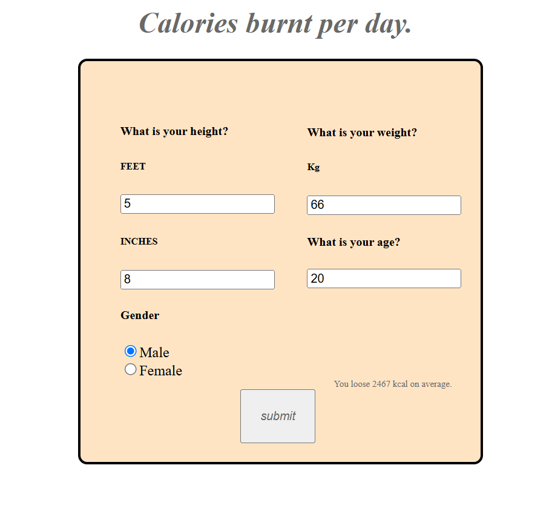

# Burnt-Calories calculator
A simple algorithm that displays average calories burnt per day.

## More
- Displays calories burnt per day.
- Takes User-data which makes it more precise.
- Interactive and purpose-based.

## Made using

- **HTML**: Basic skeleton input and output console.
- **CSS**: To style i.e add colors, depth and sizes.
- **JavaScript**: To obtain the input, process it and display the output. 

## Usage

1. Just normal cloning 
2. Open the folder
3. Checkout the Calclator on calories.html

## Screenshot

