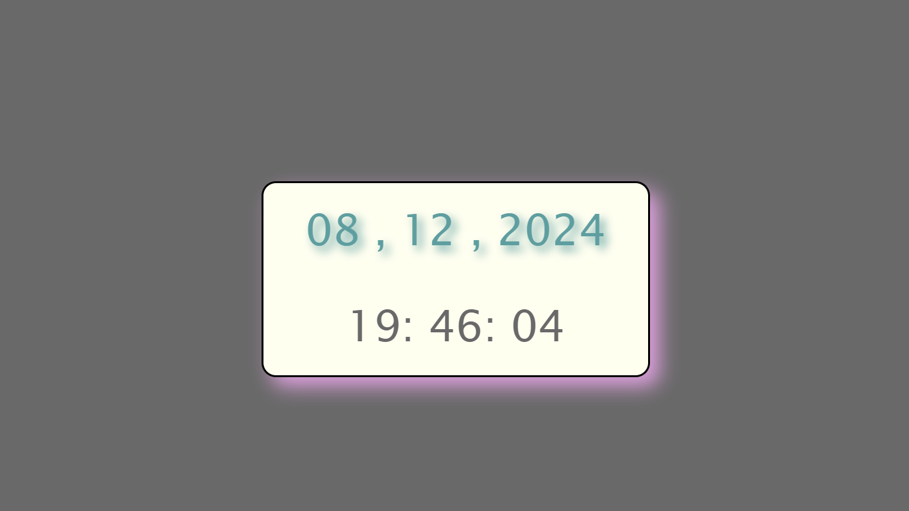

# Clock
Basic clock in sync with real time.

## More
- Displays date and time in (Day/Month/Year) and (Hour:Minute:Second) format.
- Wishes me on birthday.
- Looks asthetic AF.

## Made using

- **HTML**: Basic skeleton for the clock
- **CSS**: To style i.e add colors, depth and sizes.
- **JavaScript**: To obtain the date and update it every second(1000 ms), wish me. 

## Usage

1. Just normal cloning 
2. Open the folder
3. Checkout the clock on clock.html

## Screenshot

