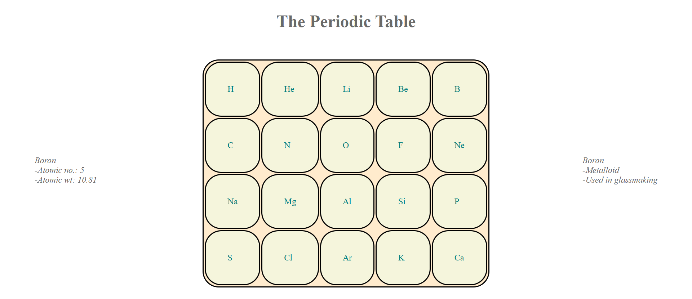

# The Periodic Table
A smaller sample of periodic table consisting of 20 elements.

## More
- Displays Atomic number, Atomic weight and some facts on hovering over elements.
- Easy interface for looking at all 20 elements at a glance.
- Reactive and accessible.

## Made using

- **HTML**: To make structure of table, output terminals and foundation for css and js.
- **CSS**: To style i.e add colors, depth and sizes.
- **JavaScript**: To obtain the info upon mouse movement and display the data. 

## Usage

1. Just normal cloning 
2. Open the folder
3. Checkout the table on periodic.html

## Screenshot

