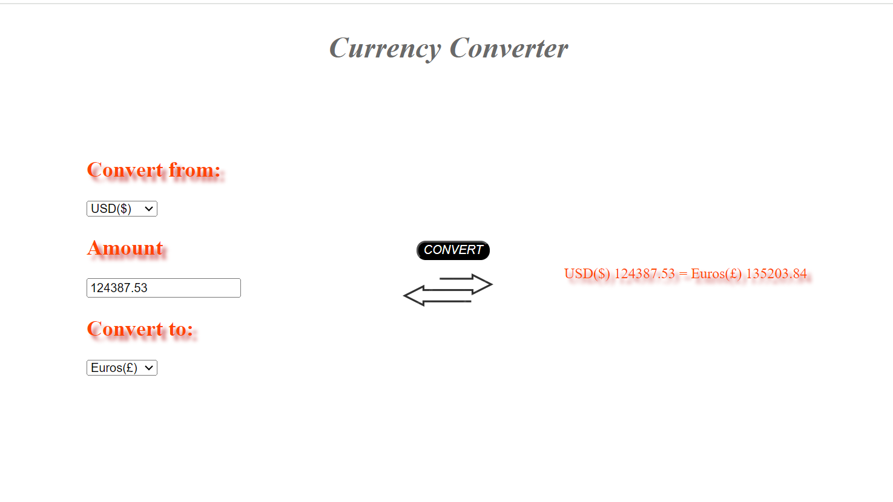

# Currency converter
Basic currency converter which swings all three ways in NRS, USD and Euros.

## More
- Converts amount from 3 different currencies to 3 different currencies.
- Alerts if input is garbage.
- Looks asthetic AF.

## Made using

- **HTML**: Basic skeleton for the converter and divisions.
- **CSS**: To style i.e add colors, depth and sizes.
- **JavaScript**: To obtain the input currency, input value, target currency, process and display output. 

## Usage

1. Just normal cloning 
2. Open the folder
3. Checkout the calculator on currency.html

## Limitation
1. Real time exchange rates are not applied.

## Screenshot

